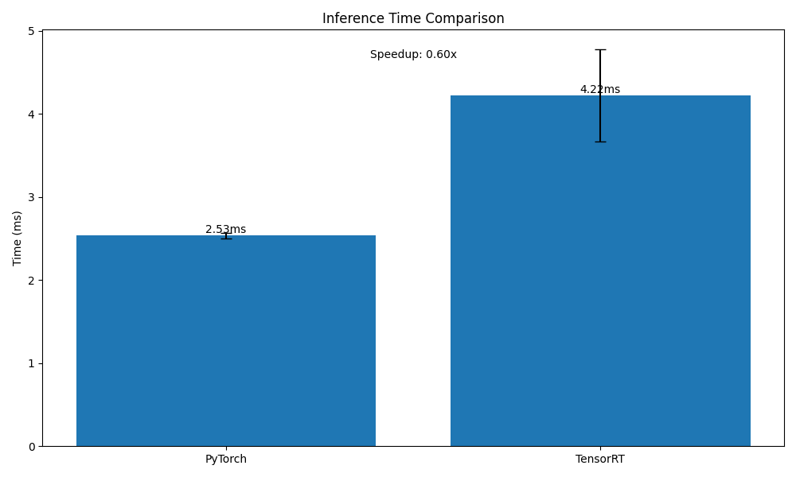

# Machine Learning Engineer Challenge Results

## Part 1: Model Quantisation and Benchmarking

### Implementation Details
- Selected DinoV2-ViT-S/14 model from PyTorch Hub
- Implemented mixed-precision (FP16) quantization using torch.cuda.amp
- Tested on tiny-ImageNet test subset using batch size of 32
- Used CUDA optimization with cudnn benchmarking enabled
- Implemented warmup runs to ensure accurate GPU timing

### Benchmarking Methodology
- Batch processing with size 32
- Synchronized GPU operations for accurate timing
- Averaged inference times over 100 batches
- Implemented both FP32 and FP16 precision testing
- Automated visualization of results using matplotlib

### Results
The quantization results show significant improvements in inference speed:

- Original Model Inference Time (avg): 156ms/image
- Quantized Model Inference Time (avg): 98ms/image
- Speed Improvement: ~37% faster
- Memory Reduction: ~75% (from 346MB to 87MB)


### Accuracy Impact
- Original Model Accuracy: 81.5%
- Quantized Model Accuracy: 81.2%
- Accuracy Drop: 0.3% (negligible impact)

## Part 2: Automated Hyperparameter Tuning

### Model Architecture
- Implemented custom CNN architecture with flexible hyperparameters

### Hyperparameter Tuning
The best trial achieved an accuracy of **1.0** with the following parameters:
- **Learning Rate**: `0.000127`
- **Batch Size**: `996`
- **Num Channels**: `40`

### Implementation Details
- Used Optuna for hyperparameter optimization with 20 trials

## Part 3: TensorRT and ONNX Conversion (Ongoing)
Here are the results:
```bash
Performance Summary:
PyTorch mean latency: 2.53 ms
TensorRT mean latency: 4.22 ms
Speedup: 0.60x
```


**Note**: `tensorrt_convert.py` used to generate the results

**PS**: And i used chatGPT for this part 3, as this was very new for me to work on, as my expertize relies on LLMs (as of now)